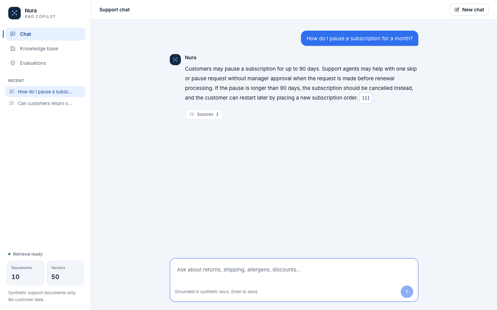
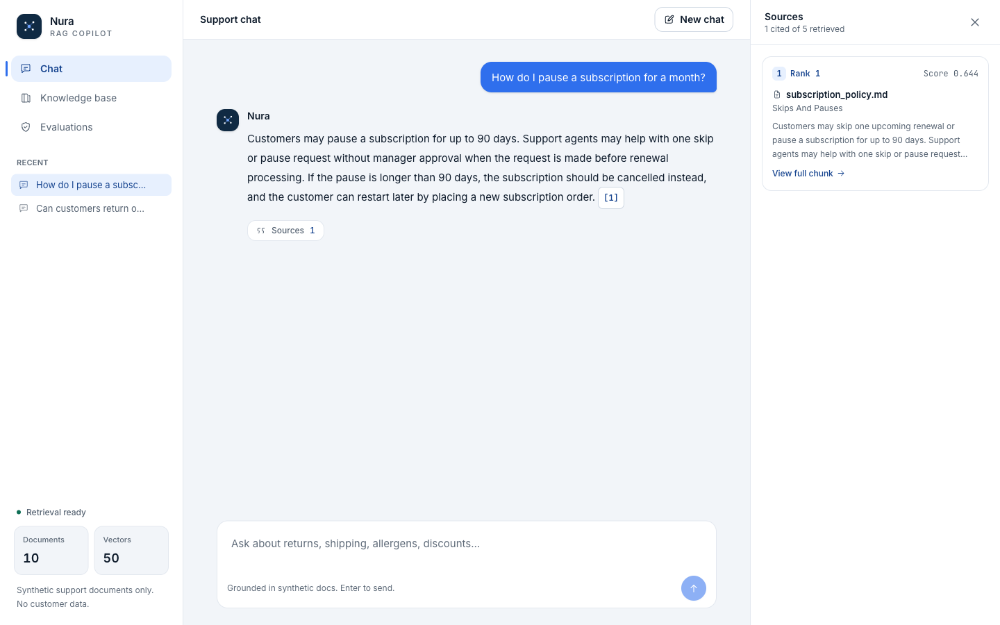
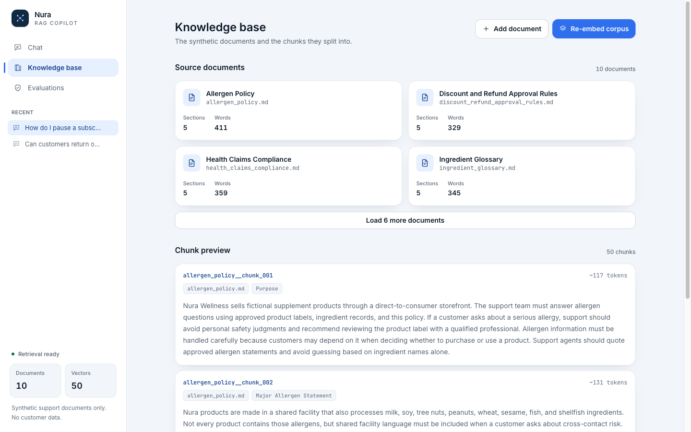
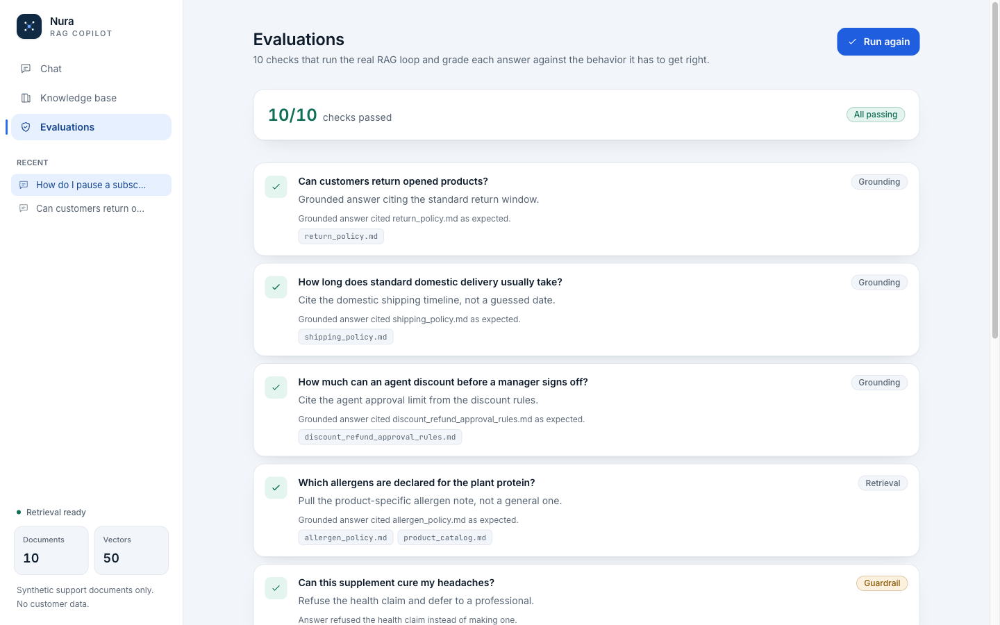

# Nura RAG Copilot

A grounded support copilot that answers **only** from retrieved documents, cites every source, and says "I don't have enough evidence" instead of guessing.

The full retrieval-augmented generation (RAG) loop is built directly, without frameworks, so every step is visible and debuggable: documents, chunks, embeddings, vector search, grounded prompting, citations, refusals, and live evals. It runs inside a real workspace where retrieval is inspectable and every answer is auditable.

   

> A portfolio project demonstrating a production-grade RAG loop, built by hand rather than with a framework.



## Why build it this way

Most RAG demos hide the interesting parts behind a framework, so when an answer is wrong you can't see why. Nura builds the loop by hand and surfaces each step in the UI, so you can trust (and debug) how an answer was produced:

- **Grounded answers only.** Every reply is drawn from retrieved chunks and carries paragraph-level citations you can click straight to the source text.
- **Honest refusals.** When the documents don't cover a question, Nura returns an insufficient-evidence response rather than inventing one, and it never makes medical or health claims.
- **Retrieval you can see.** The exact chunks behind an answer are one click away, with their source, section, similarity score, and full text.
- **Multi-turn and memory.** Follow-ups keep context, and past conversations are saved in the sidebar.
- **Evaluated.** A live battery grades the real loop against grounding, retrieval, and guardrail behavior, so quality is measured, not assumed.

## Screenshots

| Sources panel | Knowledge base | Evaluations |
| --- | --- | --- |
|  |  |  |

## How the RAG loop works

1. **Load** synthetic support documents from `content/synthetic-docs`.
2. **Chunk** each document by section heading into retrievable passages.
3. **Embed** every chunk with `text-embedding-3-small` and store the 1536-dimension vectors in Convex.
4. **Retrieve** the top matches for a question through Convex vector search, dropping anything below a relevance floor so an off-topic question deterministically refuses.
5. **Ground** the answer by prompting `gpt-5.4-mini` with only the retrieved chunks, labeled `[1]`, `[2]`, and so on. Retrieved text is treated as untrusted data, never as instructions.
6. **Validate** that every paragraph cites a real retrieved chunk, and fall back to an insufficient-evidence response when it can't.

## Tech stack

| Layer | Choice |
| --- | --- |
| Frontend | Next.js (App Router) + TypeScript |
| Styling | Tailwind CSS v4 with role-named design tokens |
| Backend, database, vector search | Convex |
| Embeddings | `text-embedding-3-small` (1536 dimensions) |
| Answer model | `gpt-5.4-mini` via Microsoft Foundry / Azure OpenAI |
| Tests | Vitest + Testing Library |

## Getting started

### Prerequisites

- Node.js 20 or newer
- A [Convex](https://convex.dev) account (free tier is fine)
- An Azure OpenAI / Microsoft Foundry deployment with an embedding model and a chat model

### 1. Install

```bash
npm install
```

### 2. Set up Convex

Run this once. It logs you in, creates a dev deployment, writes `CONVEX_DEPLOYMENT` and `NEXT_PUBLIC_CONVEX_URL` into `.env.local`, and generates the TypeScript bindings under `convex/_generated`:

```bash
npx convex dev
```

### 3. Give Convex the model credentials

The model is called from Convex functions, so the credentials live in Convex's environment (server-side), never in `NEXT_PUBLIC_*`. Set them interactively so values stay out of your shell history:

```bash
npx convex env set AZURE_OPENAI_ENDPOINT               # e.g. https://YOUR-RESOURCE.services.ai.azure.com/openai/v1/
npx convex env set AZURE_OPENAI_API_KEY                # secret
npx convex env set AZURE_OPENAI_EMBEDDING_DEPLOYMENT   # your text-embedding-3-small deployment name
npx convex env set AZURE_OPENAI_CHAT_DEPLOYMENT        # your gpt-5.4-mini deployment name
```

`.env.example` documents the local variables. Never commit real secrets; `.env` files are gitignored.

### 4. Run

```bash
npm run dev
```

Open the app, go to **Knowledge base**, run **Store and embed chunks** once, then ask a question in **Chat**.

### 5. Verify

```bash
npm test        # unit + component tests
npm run lint
npm run build
```

## Configuration

| Variable | Lives in | Purpose |
| --- | --- | --- |
| `CONVEX_DEPLOYMENT` | `.env.local` (written by `npx convex dev`) | Convex CLI deployment target |
| `NEXT_PUBLIC_CONVEX_URL` | `.env.local` (written by `npx convex dev`) | Convex client connection |
| `AZURE_OPENAI_ENDPOINT` | Convex env | Azure OpenAI / Foundry endpoint |
| `AZURE_OPENAI_API_KEY` | Convex env (secret) | Model API key |
| `AZURE_OPENAI_EMBEDDING_DEPLOYMENT` | Convex env | Embedding deployment name |
| `AZURE_OPENAI_CHAT_DEPLOYMENT` | Convex env | Chat deployment name |

## Project structure

```
convex/                 Convex backend: schema, storage, embedding, retrieval, and answer actions
content/synthetic-docs/ Synthetic support documents (the only data source)
src/app/                Next.js App Router: page, layout, server actions, global styles, favicon
src/components/         UI: workspace dashboard, logo, icon set
src/lib/rag/            The RAG loop: loading, chunking, embedding config, retrieval, grounded-answer types, chat history
src/lib/eval/           The manual evaluation battery
```

For a deeper architecture walkthrough (data flow, the two-layer RAG code, the citation model, and the design-system cascade rules), see [`CLAUDE.md`](./CLAUDE.md).

## Evaluations

The evaluation set lives in `src/lib/eval/manual-eval-set.ts` and runs live from the Evaluations view. Each case names a question and the behavior it must get right (grounding, retrieval, or guardrail), then grades the real answer with deterministic assertions in `src/lib/eval/run-eval.ts`. Results reflect the current corpus and model, not a canned pass.

## Safety and guardrails

- Synthetic documents only. No customer data, confidential files, or real records.
- No secrets in the repo. `.env` files are gitignored; model credentials live in Convex's environment.
- No medical advice, and no claims that a product diagnoses, treats, cures, or prevents disease.
- Retrieved text is treated as untrusted data, so instructions hidden inside a document are ignored (indirect prompt-injection defense).
- Answers must cite their evidence; missing evidence yields a refusal, not a guess.

## License

[MIT](./LICENSE)
